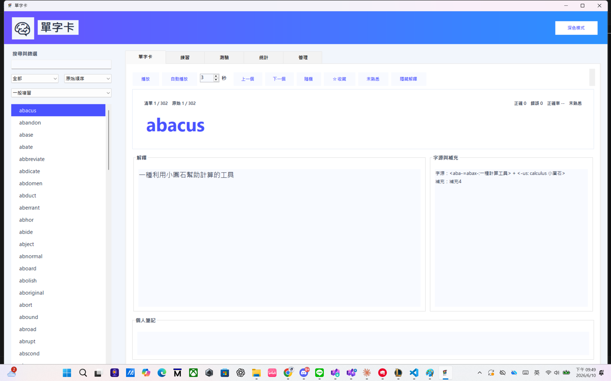
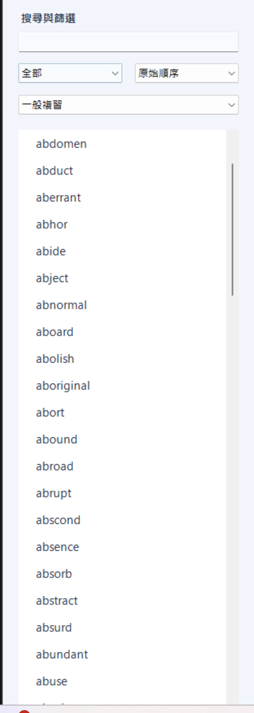
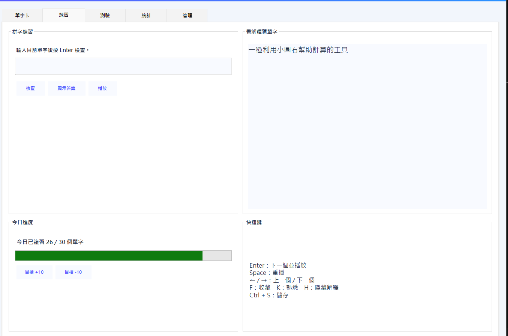
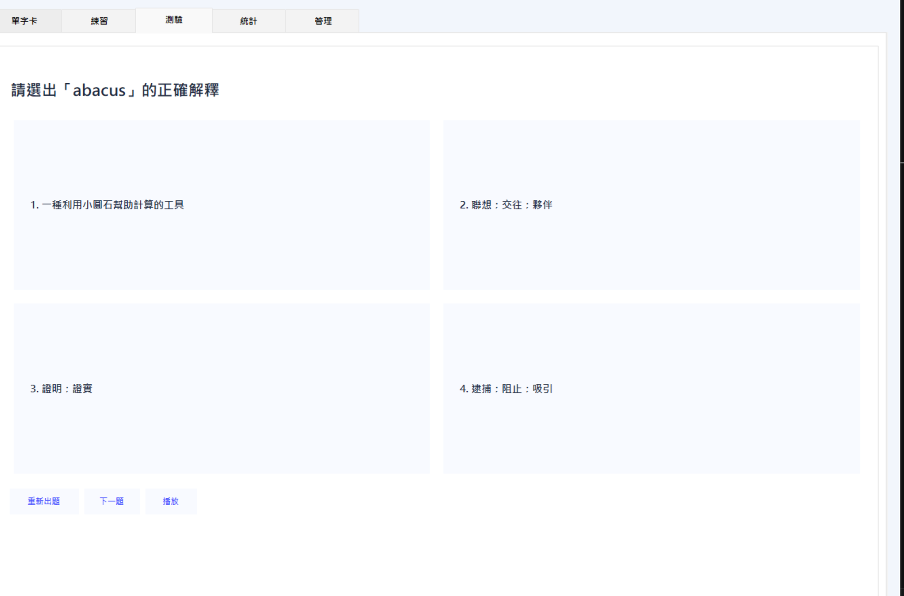
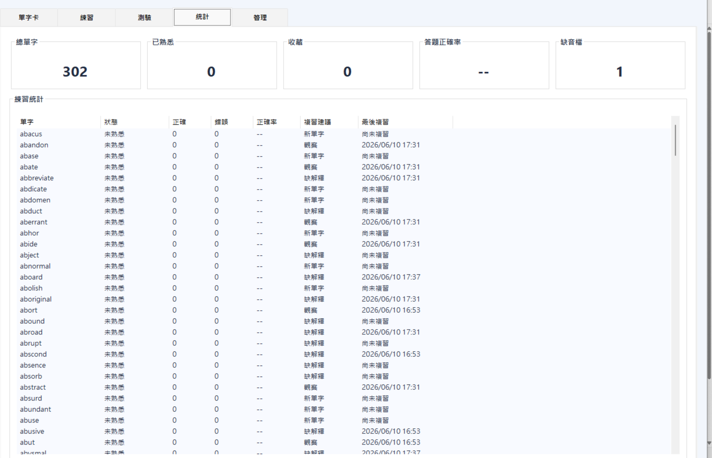
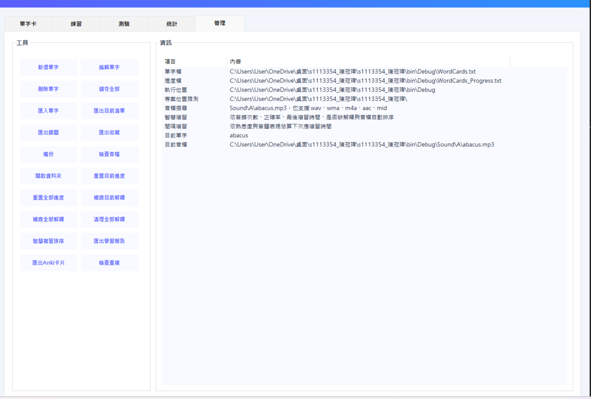

# 單字卡

一款以 C# Windows Forms 製作的單字卡學習工具，支援單字瀏覽、音檔播放、搜尋篩選、拼字練習、選擇題測驗、收藏、熟悉度標記、學習統計、匯入匯出、備份，以及智慧補齊解釋等功能。

---

## 目錄

- [專案簡介](#專案簡介)
- [功能特色](#功能特色)
- [畫面預覽](#畫面預覽)
- [環境需求](#環境需求)
- [專案檔案結構](#專案檔案結構)
- [資料格式說明](#資料格式說明)
- [音檔放置規則](#音檔放置規則)
- [使用方式](#使用方式)
- [快捷鍵](#快捷鍵)
- [進階功能](#進階功能)
- [常見問題](#常見問題)
- [後續可擴充方向](#後續可擴充方向)

---

## 專案簡介

本程式是一個桌面版英文單字卡工具，主要目標是讓使用者可以快速瀏覽單字、播放發音、查看字源與解釋，並透過測驗與拼字練習加強記憶。

程式會載入 `WordCards.txt` 作為主要單字資料來源，並依照單字音檔路徑播放對應音訊。若原始文字檔中的解釋不足，程式也預留了自動補齊與清理解釋的功能，讓學習資料更完整。

---

## 功能特色

### 單字瀏覽

- 左側單字清單快速瀏覽。
- 支援搜尋單字、音標、解釋、筆記。
- 支援依條件篩選：
  - 全部
  - 收藏
  - 熟悉
  - 未熟悉
  - 有音檔
  - 缺音檔
  - 答錯過
  - 今日未複習
- 支援排序：
  - 原始順序
  - A 到 Z
  - Z 到 A
  - 錯誤較多
  - 正確率較低
  - 最近複習
  - 隨機

### 音檔播放

- 支援播放目前單字音檔。
- 支援自動播放。
- 支援多種音檔格式：
  - `.mp3`
  - `.wav`
  - `.wma`
  - `.m4a`
  - `.aac`
  - `.mid`
  - `.midi`
- 支援 MCI、Windows Media Player、WAV SoundPlayer 備援播放。

### 練習功能

- 拼字練習。
- 看解釋猜單字。
- 選擇題測驗。
- 答題正確率統計。
- 錯題記錄。
- 今日複習進度。

### 學習管理

- 收藏單字。
- 標記熟悉 / 未熟悉。
- 個人筆記。
- 重置目前單字進度。
- 重置全部進度。
- 匯出錯題。
- 匯出收藏。
- 匯出目前清單。
- 備份單字檔。
- 檢查重複單字。
- 檢查缺少音檔。

### 介面功能

- 分頁式介面。
- 單字卡頁。
- 練習頁。
- 測驗頁。
- 統計頁。
- 管理頁。
- 深色模式。

---

## 畫面預覽


### 主畫面



---

### 單字卡頁面



---

### 練習頁面



---

### 測驗頁面



---

### 統計頁面




---

### 管理頁面



---

## 環境需求

建議使用以下環境：

- Windows 10 或 Windows 11
- Visual Studio
- .NET Framework Windows Forms 專案
- C# 語言
- 可播放音訊的 Windows 系統環境

---

## 專案檔案結構

建議結構如下：

```text
單字卡專案
├─ Form1.cs
├─ WordCards.txt
├─ WordCards_Progress.txt
├─ WordCards_Logo.png
├─ Sound
│  └─ A
│     ├─ abacus.mp3
│     ├─ abandon.mp3
│     └─ ...
└─ docs
   └─ screenshots
      ├─ main.png
      ├─ card-page.png
      ├─ practice-page.png
      ├─ quiz-page.png
      ├─ stats-page.png
      └─ manage-page.png
```

編譯後常見執行位置如下：

```text
bin
└─ Debug
   ├─ 專案.exe
   ├─ WordCards.txt
   └─ Sound
      └─ A
         ├─ abacus.mp3
         ├─ abandon.mp3
         └─ ...
```

---

## 資料格式說明

`WordCards.txt` 使用 Tab 分隔欄位。

基本格式：

```text
單字	音標	音檔路徑	解釋	補充資料
```

範例：

```text
abacus	ˋæbəkəs	Sound\A\abacus.mp3	一種利用小圓石幫助計算的工具	補充4
```

若有字源資料，也可以寫成：

```text
abacus	ˋæbəkəs	Sound\A\abacus.mp3	<aba-=abax-:一種計算工具>+<-us: calculus 小圓石>	一種利用小圓石幫助計算的工具
```

程式會嘗試將字源、補充、正式解釋分開顯示。

---

## 音檔放置規則

程式會優先讀取 `WordCards.txt` 第三欄音檔路徑。

例如：

```text
Sound\A\abacus.mp3
```

若音檔路徑空白或找不到，程式會自動依照單字名稱尋找：

```text
Sound\A\abacus.mp3
Sound\A\abacus.wav
Sound\A\abacus.wma
Sound\A\abacus.m4a
Sound\A\abacus.aac
Sound\A\abacus.mid
Sound\A\abacus.midi
```

例如單字是 `adventure`，程式會自動嘗試尋找：

```text
Sound\A\adventure.mp3
```

---

## 使用方式

1. 開啟 Visual Studio。
2. 將 `Form1.cs` 替換成目前版本。
3. 確認 `WordCards.txt` 放在可讀取的位置。
4. 確認音檔放在 `Sound` 資料夾中。
5. 執行程式。
6. 在左側選擇單字。
7. 按下「播放」聽發音。
8. 使用「練習」與「測驗」分頁進行複習。
9. 使用「管理」分頁備份、匯出、檢查音檔與管理資料。

---

## 快捷鍵

| 快捷鍵 | 功能 |
|---|---|
| Enter | 下一個單字並播放 |
| Space | 重播目前單字 |
| ← | 上一個單字 |
| → | 下一個單字 |
| F | 收藏 / 取消收藏 |
| K | 熟悉 / 未熟悉 |
| H | 隱藏 / 顯示解釋 |
| Ctrl + S | 儲存全部資料 |

---

## 進階功能

### 智慧補齊解釋

如果 `WordCards.txt` 中某些單字沒有清楚解釋，程式可以使用內建補齊資料補上。適合處理只有單字、音標、音檔，但缺少中文解釋的情況。

### 解釋清理

程式會盡量把以下內容分開：

- 正式中文解釋
- 字源資料
- 補充資料
- 原始標記格式

讓測驗選項與單字卡顯示更乾淨。

### 學習統計

程式會記錄：

- 正確次數
- 錯誤次數
- 正確率
- 是否收藏
- 是否熟悉
- 最後複習時間
- 今日複習進度

這些資料會儲存在：

```text
WordCards_Progress.txt
```

---

## 常見問題

### 為什麼有些單字顯示「尚無清楚解釋」？

因為 `WordCards.txt` 中該單字後面的解釋欄位可能是空白。可以使用管理頁中的補齊功能，或手動編輯該單字資料。

### 為什麼按播放沒有聲音？

請先確認：

1. 音檔是否存在。
2. 音檔檔名是否與單字一致。
3. 音檔是否放在正確資料夾。
4. `WordCards.txt` 第三欄音檔路徑是否正確。
5. 可以到管理頁按「檢查音檔」確認缺少哪些檔案。

### 為什麼測驗選項空白？

通常是因為該單字或干擾選項缺少可用解釋。可以先補齊解釋，再重新出題。

### 為什麼資料沒有保存？

請確認程式有權限寫入 `WordCards.txt` 與 `WordCards_Progress.txt`。建議不要把專案放在需要系統管理員權限的位置。

---

## 後續可擴充方向

- 新增 CSV / Excel 匯入。
- 新增 Anki 匯出。
- 新增錯題複習排程。
- 新增單字難度分級。
- 新增每日目標設定保存。
- 新增雲端同步。
- 新增語音辨識拼字。
- 新增例句資料庫。
- 新增 AI 自動產生例句。
- 新增依字首、字根、主題分類。
- 新增單字學習曲線圖。
- 新增完整搜尋高亮。
- 新增多使用者學習紀錄。

---

## 授權

本專案可作為課程作業、個人學習工具或 Windows Forms 練習專案使用。
